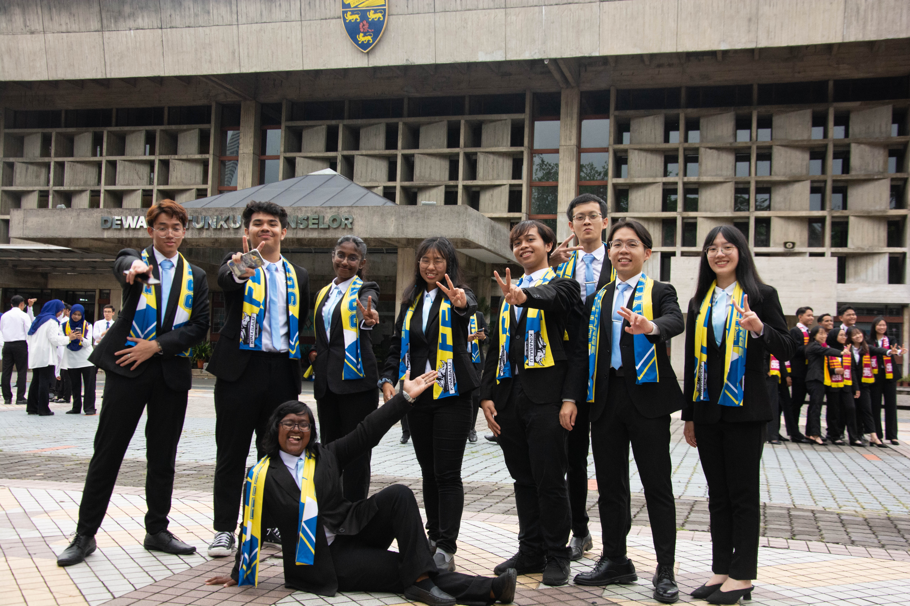

# Introduction
<h2> Hi! I'm Khiruba Sangkari a/p Malaravan, a student in the Software Maintenance and Evolution course. </h2>
I expect to learn a lot about modern software maintenance practices and how to work with legacy systems.

- **Fun fact**: I love playing badminton and I can ride the bike (I haven't gotten my B full license yet but am hoping to in the future, so its only B2 now).
- **Course expectations**: I expect to gain a lot of knowledge on Software Maintenance and Evolution as well as have fun doing so.
  

 This is me and my fellow student facilitators turned friends in front of the Dewan Tunku Canselor building in UM. 

## GitHub Profile
You can view my personalized GitHub profile in the link below.
### [https://github.com/khiru27](https://github.com/khiru27).
